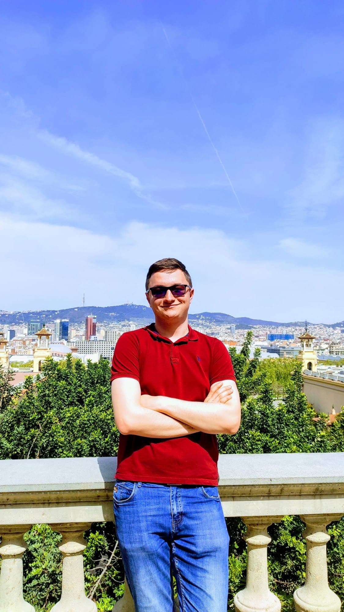

<!-- ## Lucian Istrati - ML Engineer and AI Enthusiast-->

### General information:

- Nationality: Romanian
- Mail:  lucianistrati@yahoo.com
- Languages: Romanian/English (bilingual), French/Spanish (intermediate), German (beginner)
- Programming languages: Python (advanced), C++/Java (intermediate), R/Julia (beginner)
- 📫 How to reach me?
  - connect with me on LinkedIn at [lucian-istrati](https://www.linkedin.com/in/lucian-istrati/)

### About me

I am currently working as a member of the founding team at Proofcheck where I work as Lead AI Engineer. 

I have two years of working experience in Machine Learning. The companies/institutions I worked for are (in chronological order): [SRI(Romanian Intelligence Service)](https://www.sri.ro/), [Metaminds](https://www.metaminds.com/), [EmailTreeAI](https://emailtree.ai/) and [Ordaos Bio](https://ordaos.bio/). I worked with all kinds of data in my ML engineering roles: video, image, text, biological, timeseries and tabular.

My personal projects are various from timeseries analysis & forecasting to information extraction & name entity recognition, from various text classifications & visualization projects to multimodal & representational models.

On the educational side I graduated one year ago with Bachelor of Science Degree in Computer Science at University of Bucharest. I am midway through my Master of Science Degree in Data Science at the same university. For the future I am considering starting a Ph.D. Degree in Machine Learning next year, I would like to do it in France, Germany or in the USA.

I have also plenty of interest into research, unfortunately I managed to publish just one paper so far with some other works being left unfinished. Hopefully with time I will have more stuff to showcase on [ResearchGate](https://www.researchgate.net/profile/Lucian-Istrati-2) and [GoogleScholar](https://scholar.google.com/citations?view_op=list_works&hl=en&hl=en&user=us0728YAAAAJ&citft=1&citft=2&citft=3&email_for_op=lucian.istrati%40my.fmi.unibuc.ro)

My main interests are in Natural Language Understanding (especially Information Extraction & Multi-level Text analysis), Timeseries (Analysis / Forecasting / Anomaly detection), Representational Learning, Multimodal Learning and Recommender Systems.

Other hobbies of mine outside Computer Science: reading, sports, travelling, politics and language learning.

### Contact

You can take a look at my CV <a href="static/CV_NOV_2023.pdf" target="_blank">here</a> or at my Github account <a href="https://github.com/lucianistrati" target="_blank">here</a>. If you are interested in a collaboration write me at my Email - lucianistrati@yahoo.com, message me on [Facebook](https://www.facebook.com/istrati.lucian/) / [Twitter](https://twitter.com/LucianIstrati) or connect with me on [LinkedIn](https://www.linkedin.com/in/lucian-istrati/). Let me know if you are in Bucharest and want to meet for a chat.
